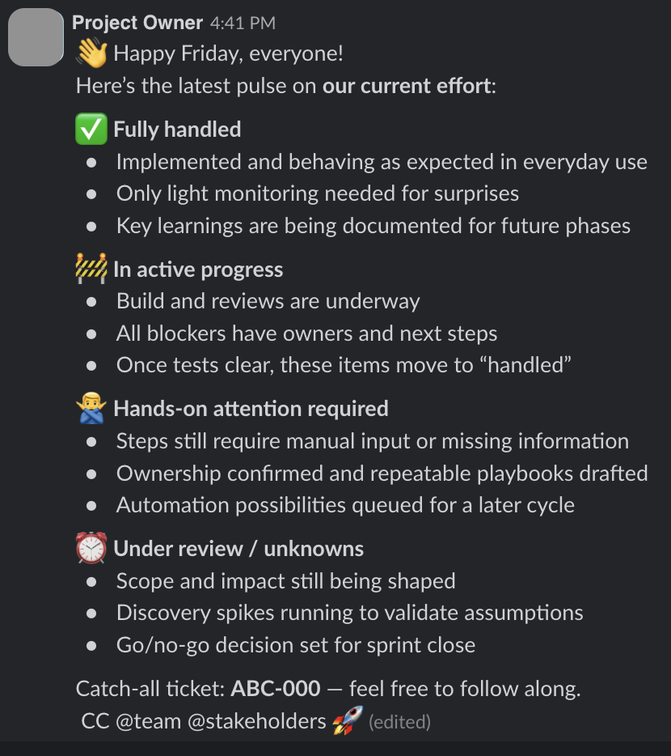
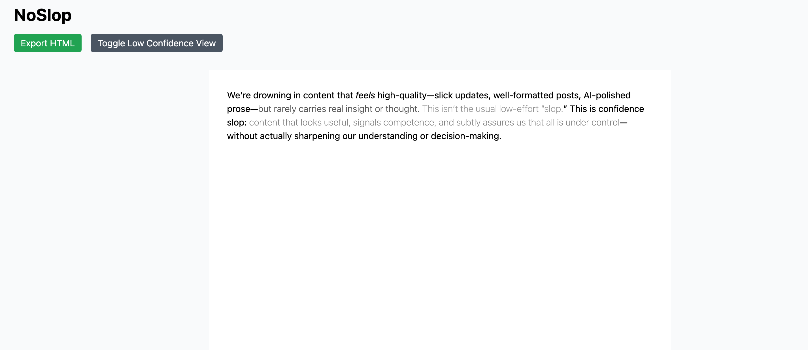
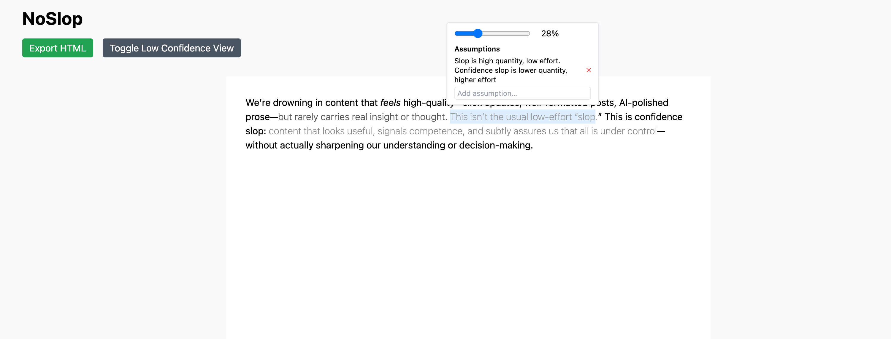

Both reading and writing suck now.

# Everything _seems_ high quality, little is
I'm sure if you have been on Instagram, Twitter, or, god forbid, Facebook recently, you are no stranger to _slop_. Slop commonly denotes low effort media that puts quantity over quality. Though hard to precisely define, it is easy to identify. On the other side of this spectrum, I put what I would call _confidence slop_. Confidence slop is content that appears to be high quality because 
1. the communication is targeted and not too spammy
2. some human thinking has probably gone into it
3. AI was used to to communicate the outputs of this thinking in a way that sounds reassuring

Examples of this are status updates in any of your Slack channels that use emojis to highlight important paragraphs and tag all the right people. They all look the same, but they clearly do not all describe the same states of the world. It is relatively easy to define, but to differentiate what is confidence slop and what is actually good work is very hard.

In the above message, many different thoughts are communicated, most of which do not have much impact on decision-making in the future. A little differentiation is made between levels of confidence of certain items. However, the general tenor of the update is "everything is under control" and lots of uncertainty is abstracted away under language that feels like it should give you confidence that everything will go well (e.g. "All blockers have owners and next steps"). Obfuscating this uncertainty is one of the key detriments of confidence slop. The message's format is almost ideally designed to make the reader's eyes glaze over and evoke an as-of-yet-undeserved sense of trust. Nevertheless, there is always a lot of truth to confidence slop, making it hard to disentangle what to believe and what to question.

Confidence slop is not new. Some people are predisposed to it and some professions even teach it as a rite of passage. As a PM, I produce it regularly. What has made it ubiquituous however is the availability of AI writing tools. 

Combatting confidence slop is much important than normal slop to me. Slop and psychological defense against slop is memetic in that by engaging with slop, most people start to build up mental models that identify and ignore it. Confidence slop is anti-memetic in that it is very hard to identify whether one should actually put stock into a statement or not, so fewer people build up defenses to it.

## A forcing function for thought
Confidence slop is not just an intellectual crime against the reader; it is also a crime against oneself. To write is to structure one's thoughts and to calibrate one's confidence in them. By engaging in confidence slop, you lose the ability to identify gaps in your thinking. Additionally, you will not be able to look back at a later date and re-evaluate your confidence levels in a certain belief.

I want to be clear: Using AI to write is not bad in and of itself. You just need to make sure it doesn't make everything sound the same. This seems like a problem software could solve.

# A better writing experience
## Communicating confidence
The core problem of confidence slop is that it has become too easy to produce it. To combat it, we need to introduce the right amount of friction to the process of writing. I built a small prototype to indicate how this could work. 

One approach to do this would be to visually communicate confidence levels. This needs to happen in a non-obtrusive way. My first idea was to play with the font weight as an indicator of the confidence level with faint writing showing low confidence in a belief.

I like this approach because it naturally draws the eye to the beliefs that are low confidence, hopefully allowing the writer and later the reader to think more about whether they should be upheld or not.

## Assumptions are second-level
People often try to communicate uncertainty about a belief with a clarifying comment on their own document. This also achieves drawing the eye, but it does not allow you to easily prioritize which uncertainty to address first as you really need to read every comment for that. In the model above, uncertainty is communicated by font weight, allowing prioritization. How to deal with the uncertainty is a second-level idea. Therefore, I made the choice to only show assumptions when viewing a specific belief.

_Code for the prototype can be found in the corresponding [Github repo](https://github.com/tobiaswirtz/NoSlop)._

## Continuous reflection on beliefs
I think this writing experience allows oneself to structure one's own thoughts in a better way. What is missing here as an exercise to both reader and writer is tracking beliefs throughout time, in the micro and macro way. Adding an assumption should automatically update confidence levels, for example. Moreover, some beliefs and assumptions should probably be re-evaluated at some time in the future.

To really build something that could improve writing and communication for a wider audience, the approach would also have to be ported to a chat format rather than just existing in documents.
